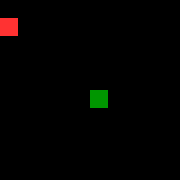
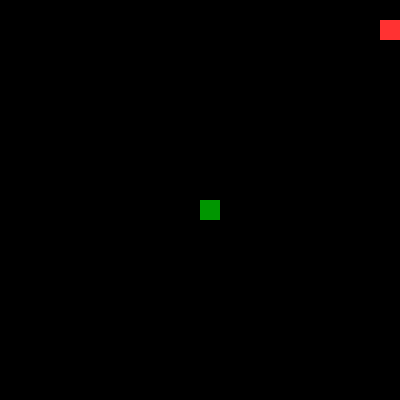
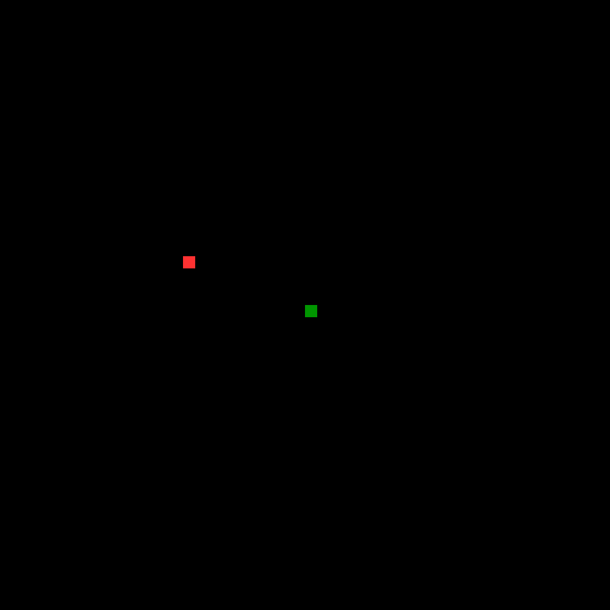
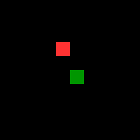
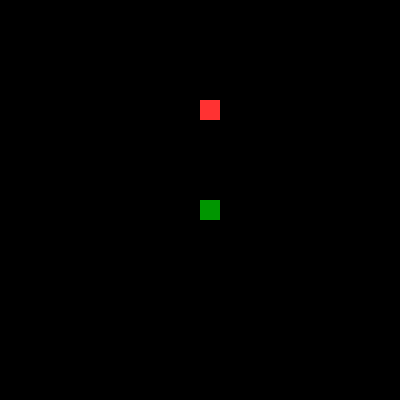
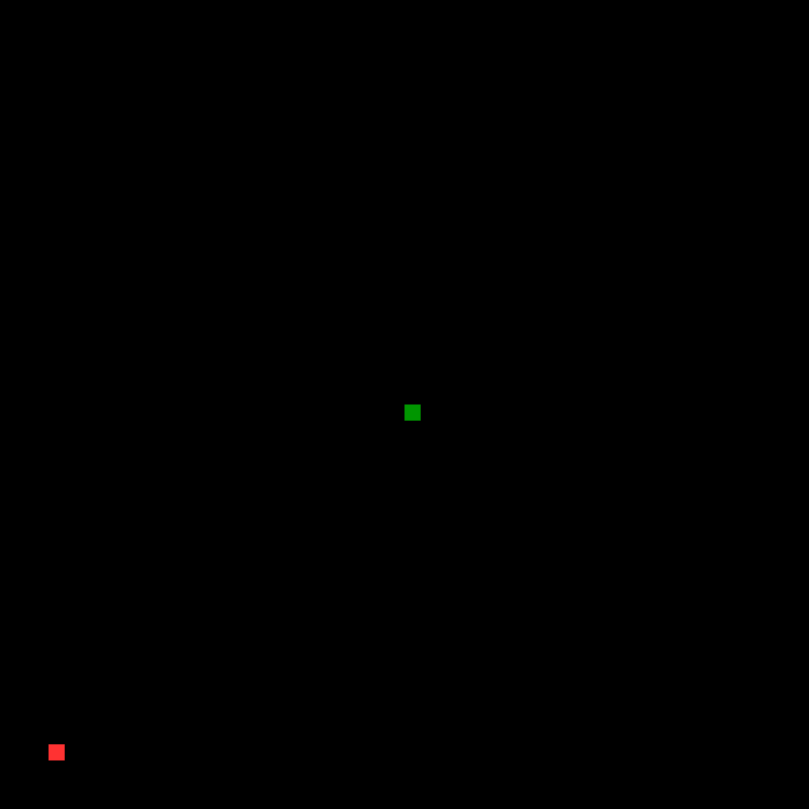

# Especialización en Inteligencia Artificial (CEIA - FIUBA)
# Aprendizaje por Refuerzo I - Desafío Práctico: *Snake* 🐍

## 📌 Descripción del Proyecto
Este repositorio contiene la implementación y análisis comparativo de dos algoritmos de control de Aprendizaje por Refuerzo (RL) aplicados al clásico entorno del juego *Snake*. El objetivo principal es evaluar la eficiencia y capacidad de generalización espacial frente al problema de la dimensionalidad.

Se contrastan dos enfoques:
* **Método Tabular (Off-Policy):** Q-Learning.
* **Aproximación de Funciones:** Deep Q-Network (DQN) con *Experience Replay*.

Para evitar la "maldición de la dimensionalidad" y permitir la convergencia tabular, se implementó **Ingeniería de Características**, abstrayendo el entorno (*Full Grid*) a un espacio de observación relativo de solo **11 variables booleanas** (peligros inmediatos, dirección actual y ubicación relativa del objetivo).

## 📂 Contenido del Repositorio
* `RL1_Desafío_Snake_Pulido.ipynb`: Jupyter Notebook (preparado para Google Colab) que contiene el código fuente completo: definición del entorno Gymnasium personalizado, agentes, bucles de entrenamiento (3000 episodios) y análisis de convergencia.
* Archivos `.gif`: Grabaciones de las pruebas empíricas de los modelos.

## 🚀 Pruebas de Generalización (*Zero-Shot Transfer*)
Debido a la topología relativa del estado diseñado, los agentes adquirieron una política universal. A continuación se demuestra empíricamente cómo el modelo entrenado en una grilla de 10x10 es capaz de operar en entornos escalados sin reentrenamiento previo.

### Agente Tabular (Q-Learning)
Demostró una robustez superior al escalar el mapa, sin sufrir degradación por la dispersión de los objetivos.
| 10x10 | 20x20 | 50x50 |
| :---: | :---: | :---: |
|  |  |  |

### Agente Deep Q-Network (DQN)
Demostró buena generalización en entornos contenidos, pero exhibió signos de sobreajuste (*overfitting*) a las dinámicas espaciales reducidas al enfrentarse a la inmensidad del mapa de 50x50.
| 10x10 | 20x20 | 50x50 |
| :---: | :---: | :---: |
|  |  |  |

---

## 👩‍💻 Autora
* **Pryszczuk, Sabrina Daiana** - Alumna de la cohorte 22Co2025 - CEIA FIUBA.

